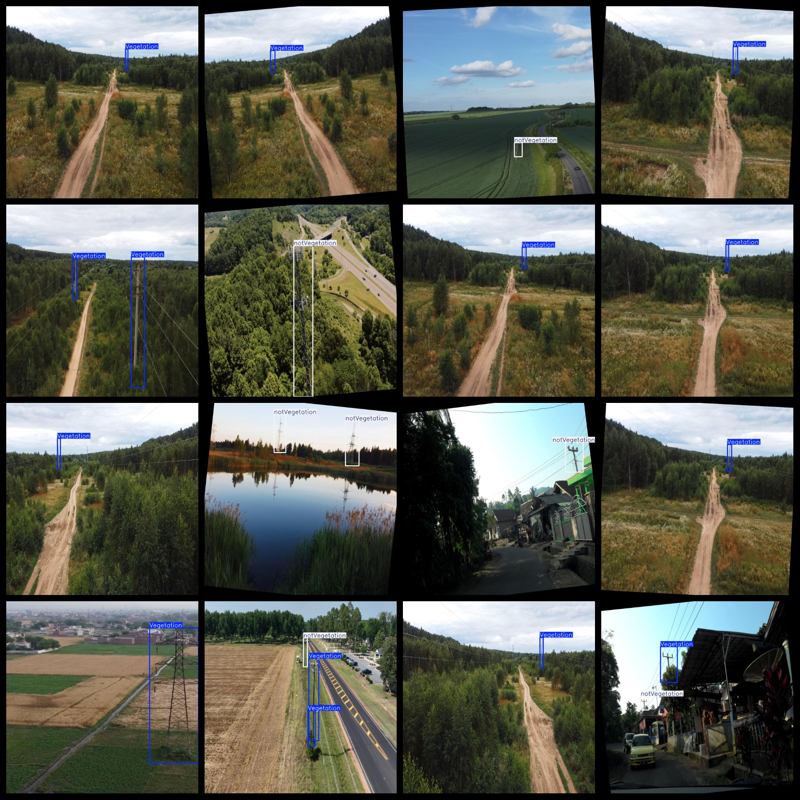

# UAV View Aerial Transmission Line Vegetation Coverage Detection Dataset 6953 images

The dataset format is Pascal VOC format combined with YOLO format (excluding the split path in txt files, only including jpg images along with corresponding VOC format xml files and YOLO format txt files).

Number of images (jpg file count): 6953

Number of annotations (xml file count): 6953

Number of annotations (txt file count): 6953

Number of annotation categories: 3

Repository location: datasets_sl

Annotation category names (note that the order in the YOLO format does not correspond to this, but refer to the "labels" folder's "classes.txt"): ["Vegetation", "nest", "notVegetation"]

Number of bounding boxes for each category:

Vegetation bounding box count = 4097 (vegetation)

nest bounding box count = 350 (bird nest)

notVegetation bounding box count = 6767 (without vegetation)

Total bounding box count = 11214

Number of images per category:

Vegetation images count = 3671

nest images count = 350

notVegetation images count = 3866

Image resolution: 640x640

Annotation tool used: labelImg

Dataset enhancement: Yes

Annotation rules: Draw a rectangle around the category

Important notice: The dataset does not have a separate training/validation/test set to be divided; users must divide it themselves.

Special declaration: This dataset does not guarantee any accuracy on models trained or weight files.

Annotation and image conditions are as follows:

## Images

---

Here is a pay link on Stripe (https://buy.stripe.com/3cs8yP7sY87d0vu9AB). Please contact me lonlonago@foxmail.com after funding $89, and I will send you a complete data files, thank you!

